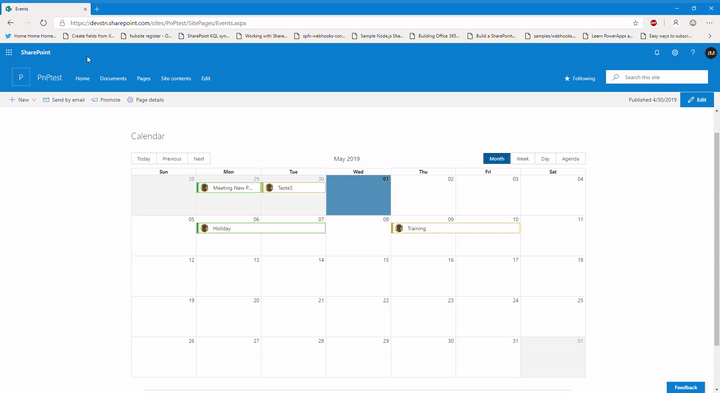
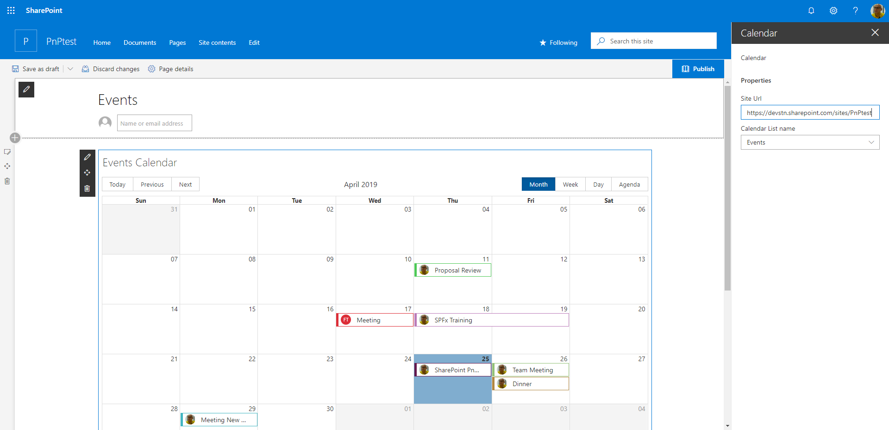
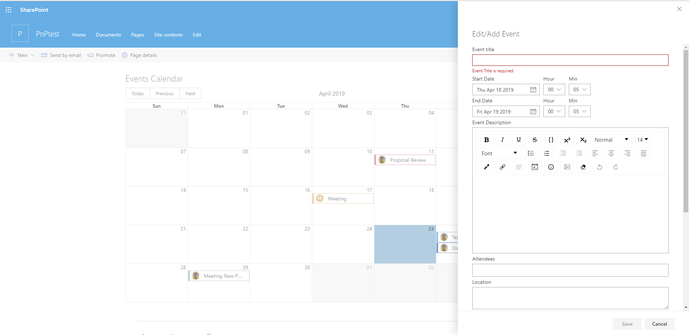
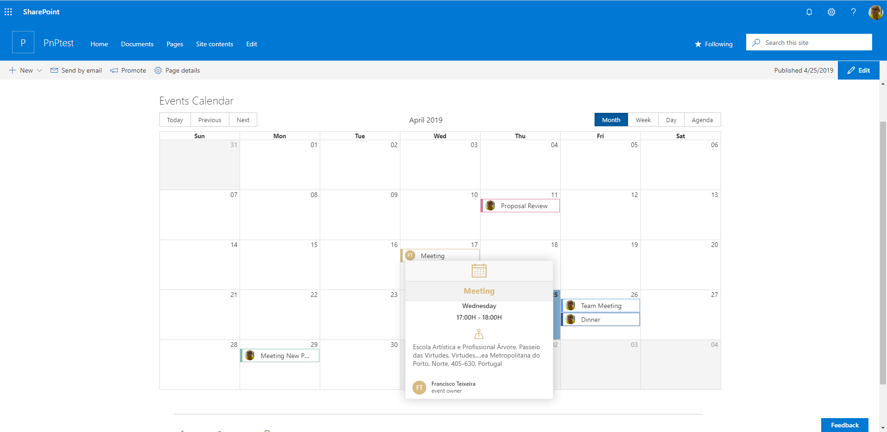

# Calendario basado en ReactJS

## Summary
Este Webpart hace parte de la integración de nuevos componentes en Intranet Medicamentos.
Con este Webparte se busca facilitar el uso de los eventos y la configuración visual del mismo.
Se toma como base el projecto React Calendar de la librería Spfx

 

 

 

 

##  Web Part  - Screenshots

## Used SharePoint Framework Version 

## Applies to

* [SharePoint Framework](https:/dev.office.com/sharepoint)
* [Office 365 tenant](https://dev.office.com/sharepoint/docs/spfx/set-up-your-development-environment)

## WebPart Properties
 
Property |Type|Required| comments
--------------------|----|--------|----------
Site Url of Calendar List | Text| yes|
Calendar list| Choice/Dropdown | yes|  this is filled with all list of  type "event list" created
Start Date | Date | yes | Event Date 
End Date| Date| yes | Event Date

## Solution
The Web Part Use PnPjs library, Office-ui-fabric-react components. react Big-Calendar Compoment

---

## Minimal Path to Awesome

- Clone this repository
- in the command line run:
  - `npm install`
  - `gulp build`
  - `gulp bundle --ship`
  - `gulp package-solution --ship`
  - Add to **AppCatalog** and deploy
# colsubsidiomedicamentos-calendario
